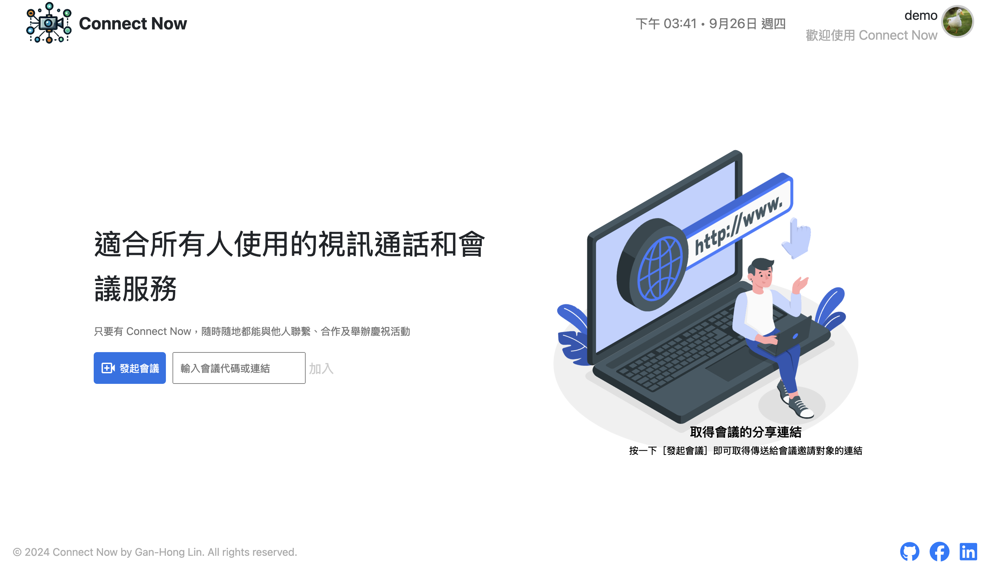

# Project Name: ConnectNow

**ConnectNow** is an easy-to-use web-based video conferencing platform designed to facilitate seamless communication and collaboration for multiple participants. This project offers a robust set of features, including:

- Real-time video and audio streaming
- Dynamic room creation
- Screen sharing
- Subtitle generation and transformation
- Interactive tools such as polls, chat, and breakout rooms


## Table of Contents
- [Project Name: ConnectNow](#project-name-connectnow)
  - [Table of Contents](#table-of-contents)
  - [Features](#features)
  - [Technologies](#technologies)
    - [Back-End](#back-end)
    - [Front-End](#front-end)
    - [Database](#database)
    - [Cloud Service (AWS)](#cloud-service-aws)
    - [Testing \& CI/CD](#testing--cicd)
    - [Other Tools](#other-tools)
  - [Installation](#installation)
  - [Usage](#usage)

---

## Features
- **Real-time Video & Audio**: Smooth video and audio streaming with WebRTC.
- **Dynamic Room Creation**: Instantly create and manage video conferencing rooms.
- **Screen Sharing**: Share screens with participants for enhanced collaboration.
- **Subtitle Generation**: Convert video content into subtitles for accessibility.
- **Interactive Polls and Chat**: Engage participants with polls and a chat system.
- **Breakout Rooms**: Split participants into smaller groups for focused discussions.

## Technologies

### Back-End
- **Node.js**: Server-side JavaScript runtime.
- **Express**: Web framework for building API and handling server logic.
- **Socket.IO**: Real-time bidirectional event-based communication.

### Front-End
- **JavaScript**
- **HTML**
- **WebRTC**: Real-time communication for audio, video, and data sharing.
- **MediaPipe**: Provides background blurring and transformation features.

### Database
- **MySQL**: Relational database for storing user and room data.
- **Redis**: In-memory data structure store, used for managing real-time chat states and caching.

### Cloud Service (AWS)
- **Elastic Compute Cloud (EC2)**: Virtual servers for running the application.
- **Simple Storage Service (S3)**: Storage for video recordings and subtitle files.
- **Relational Database Service (RDS)**: Managed MySQL database for the platform.
- **ElastiCache for Redis**: Caching layer for real-time communication.
- **CloudFront**: Content delivery network (CDN) for fast content distribution.
- **Route 53**: Domain Name System (DNS) web service for routing traffic.
- **Elastic Load Balancer (ELB)**: Distributes incoming traffic across multiple EC2 instances.
- **Auto Scaling**: Automatically adjusts the EC2 instance count to meet traffic demands.

### Testing & CI/CD
- **Jest**: Testing framework for ensuring code functionality.
- **GitHub Actions**: Continuous Integration/Continuous Deployment (CI/CD) pipeline for automated testing and deployment.

### Other Tools
- **Git / GitHub**: Version control and collaboration.
- **MVC Design Pattern**: Follows the Model-View-Controller architecture.
- **ESLint**: Linting tool for maintaining code quality.

---

## Installation

1. Clone the repository:
   ```bash
   git clone https://github.com/your-username/connectnow.git
   cd connectnow
2. Install dependencies for the back-end:
   ```bash
   npm install
3. Set up the environment variables for the cloud services and database connections
   ```bash
    MYSQL_USER
    MYSQL_HOST
    MYSQL_PASSWORD
    REDIS_URL
    JWT_SECRET_KEY
    AWS_ACCESS_KEY
    AWS_SECRET_KEY
    BUCKET_NAME
    ENV
    SQS_URL
    SQS_URL_2
    CDN_URL
    INSTANCE_ID
    GOOGLE_AUTO_CLIENT_ID
    GOOGLE_AUTO_CLIENT_SECRET
    STATIC_FILE_URL
    DOMAIN

4. Replace the domain name and AWS CloudFront URL with your own in the frontend static JS files.
---

## Usage
1. Start the server
   ```bash
   npm start
2. Access the web application at http://localhost:8080 or your own domain.